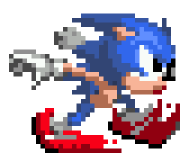
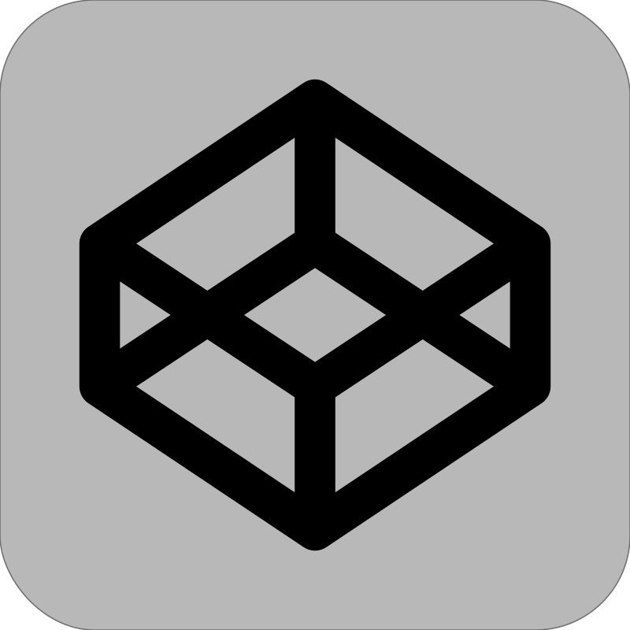

#  Hi, I’m Cass  

🌱 | Junior Frontend Developer actually trainee **@BeCode**  
🕹️ | I also like video game, horseriding and photographie  

## Tech Stack :

   &nbsp;
   &nbsp;
   &nbsp;
   &nbsp;
   &nbsp;
   &nbsp;
   

## GitHub Stats :

  

 ## Stay Connected :

   &nbsp;
   &nbsp;
  

 

